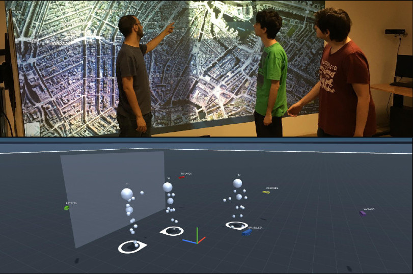
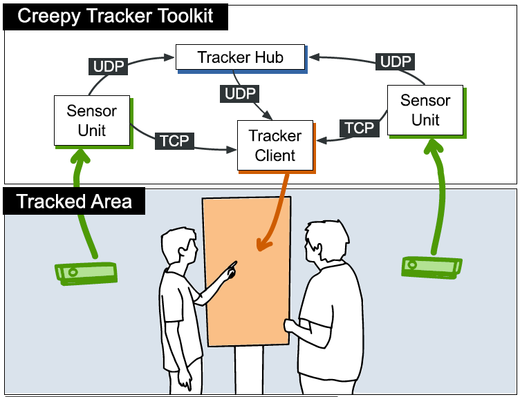

# Creepy Tracker Toolkit README

The Creepy Tracker eases prototyping with multiple commodity depth cameras. It automatically selects the best sensor to follow each person, handling occlusions and maximizing interaction space, while providing full-body tracking in scalable and extensible manners. It also keeps position and orientation of stationary interactive surfaces while offering continuously updated point-cloud user representations combining both depth and color data.

Here is an example scene from our *Creepy Tracker* project (Top: three users in front a wall display; Bottom: how the Creepy Tracker sees it):

 

The toolkit has four main components:

* **[Sensor Client](sensor-client/)** - A sensor client is connected to an individual depth sensor, and captures color, depth data and the body tracking model of every observed person in the tracked area.

* **[Tracker Hub](creepy-tracker-hub/)** - The Tracker Hub component handles the unified model of the tracked area by combining the data streams from all sensor units.

* **[Tracker Client for Unity3D](ct-application-template/)** - Set of Unity3D templates, with scripts and tools, that simplfies the development of new projects using the Creepy Tracker.

* **[Surface Calibration](surface-rectangle/)** - A standalone C# surface calibration tool.

Each component communicates with the others according to the following architechture:

 

## Citation

Please cite this work using the following reference:

```
@inproceedings{Sousa:2017:CTT:3132272.3134113,
 author = {Sousa, Maur\'{\i}cio and Mendes, Daniel and Anjos, Rafael Kuffner Dos and Medeiros, Daniel and Ferreira, Alfredo and Raposo, Alberto and Pereira, Jo\~{a}o Madeiras and Jorge, Joaquim},
 title = {Creepy Tracker Toolkit for Context-aware Interfaces},
 booktitle = {Proceedings of the 2017 ACM International Conference on Interactive Surfaces and Spaces},
 series = {ISS '17},
 year = {2017},
 isbn = {978-1-4503-4691-7},
 location = {Brighton, United Kingdom},
 pages = {191--200},
 numpages = {10},
 url = {http://doi.acm.org/10.1145/3132272.3134113},
 doi = {10.1145/3132272.3134113},
 acmid = {3134113},
 publisher = {ACM},
 address = {New York, NY, USA},
 keywords = {Context-aware Computing, Rapid-Prototyping, Toolkit},
} 
```
